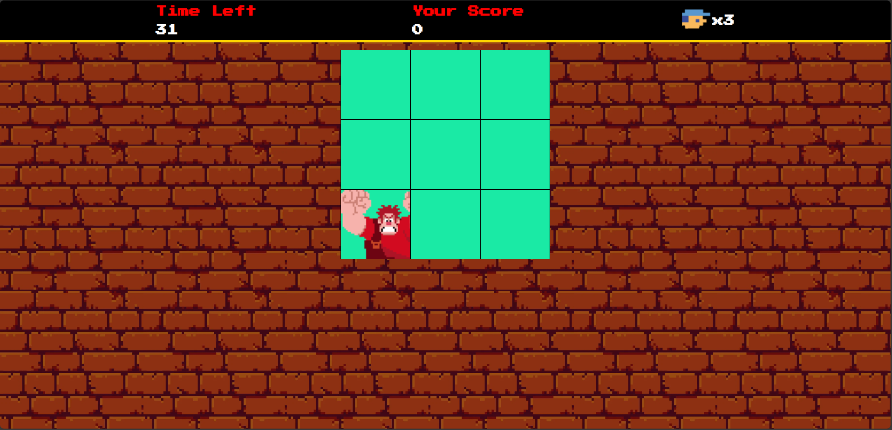

# Detona Ralph - Clique para Pontuar
Este projeto foi desenvolvido durante o bootcamp de Frontend da DIO, com o objetivo de aplicar conceitos de HTML, CSS e JavaScript na criação de um jogo interativo. Inspirado no personagem Detona Ralph, o jogo desafia os reflexos do jogador.

## Funcionalidades:
#### Objetivo do jogo: 
O personagem Detona Ralph aparece aleatoriamente na tela, e o jogador precisa clicar nele o mais rápido possível para marcar pontos.
#### Limite de tempo: 
O jogo tem uma duração de 60 segundos, e o objetivo é marcar o maior número de pontos dentro desse período.
Interface simples e divertida: Com elementos estilizados em CSS e animações suaves, o jogo oferece uma experiência visual cativante e dinâmica.
#### Lógica de jogo:
Utilizando JavaScript, o personagem aparece em posições aleatórias na tela, e o tempo restante é exibido enquanto o jogador tenta bater seu próprio recorde de pontos.
Feedback instantâneo: A cada clique no Detona Ralph, o jogador recebe pontos e um feedback em audio e o personagem continua mudando rapidamente de posição.

